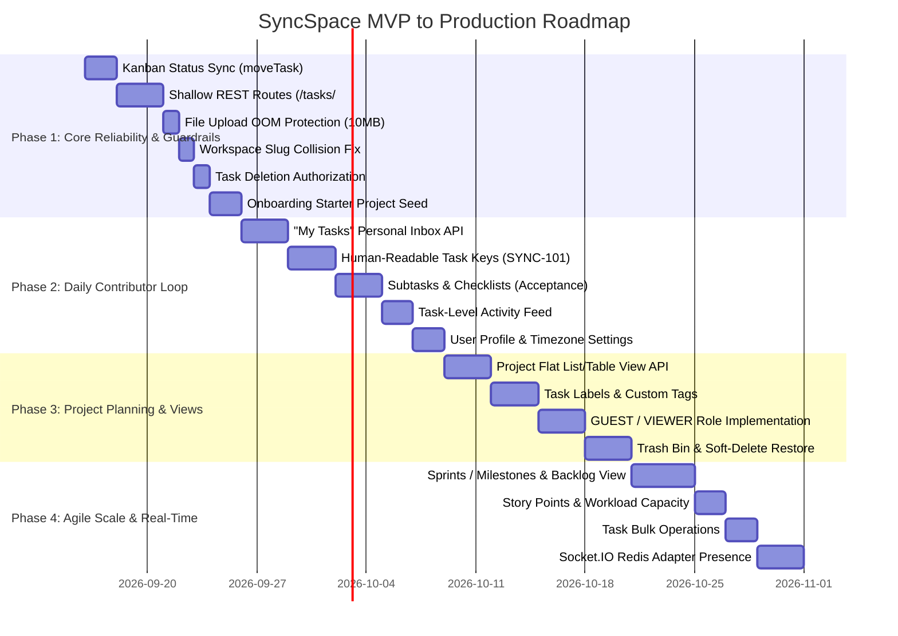

# SyncSpace — Comprehensive Product, UI/UX & Real-World Workflow Audit

> **Document Type:** Production Readiness, Product Strategy, UI/UX Architecture & Real-World Workflow Audit  
> **Audited Platform:** SyncSpace API (NestJS 11, Prisma 7, PostgreSQL, Socket.IO, Redis/BullMQ)  
> **Target Audience:** Engineering Leads, Product Managers, UI/UX Designers, AI Agents  
> **Status:** Planning Phase — Official Project Architecture & Product Document  
> **Last Updated:** September 2026  

---

## Executive Summary

SyncSpace has established an impressive, production-grade technical foundation with modular NestJS architecture, transactional boundary management (`$transaction`), structured logging (`nestjs-pino`), asynchronous job processing (`BullMQ` + Redis), and real-time Socket.IO capabilities.

However, a comprehensive audit from the perspective of **Lead Product Management** and **Principal UI/UX Design** reveals that the platform currently operates as a collection of technical endpoints rather than a complete, real-world team workspace. 

Teams adopting SyncSpace in production today would encounter critical operational hurdles:
1. **Broken Daily Worker Workflows:** Inability for individual contributors to view their personal tasks across the workspace ("My Tasks"), lack of human-readable task keys (`SYNC-101`) for Git commits and Slack discussions, and absence of subtasks/checklists.
2. **Management & Planning Blindspots:** No separation between Backlog and active Sprints, no capacity or story point estimation (workload is measured strictly by task count, equating a 1-minute typo to a 3-week migration), and no bulk triage operations.
3. **Severe Technical & Architectural Hazards:** Moving Kanban cards breaks subsequent comment/upload requests due to 8-level nested URLs, Kanban column moves leave task status desynchronized (breaking Dashboard analytics), and slug collisions crash team signups.
4. **Client & Governance Gaps:** No Guest/Viewer role for external clients, no Trash bin to restore soft-deleted items, dormant project privacy, and unrestricted task deletion by regular members.
5. **Launch-Day Operational Risks:** Unconstrained file uploads risking container Out-Of-Memory (OOM) crashes, a completely blank canvas on signup driving 70% onboarding drop-off, and meeting latency bottlenecks.

This document details all **31 findings** across 7 core pillars and outlines an actionable 4-phase transformation roadmap.

---

## Comprehensive Audit Matrix

| Pillar | Scope | Critical | High | Medium | Total Findings |
|:---|:---|:---:|:---:|:---:|:---:|
| **Pillar 1: Daily Worker Workflows (IC)** | Personal inbox, task keys, subtasks, task changelog | 2 | 2 | 1 | 5 |
| **Pillar 2: Project Management & Planning** | Sprints, backlogs, estimation, bulk actions | 1 | 3 | 1 | 5 |
| **Pillar 3: API & Route Architecture** | URL nesting, moving task race conditions, links | 2 | 1 | 1 | 4 |
| **Pillar 4: State Synchronization & Tenancy** | Kanban status sync, slug collisions, invitations | 2 | 2 | 1 | 5 |
| **Pillar 5: Security, Governance & Roles** | Member deletion hole, guest role, trash restore, audit | 1 | 3 | 1 | 5 |
| **Pillar 6: Visualizations & Real-Time Polish** | Flat list views, labels, emoji reactions, Redis presence | 0 | 2 | 2 | 4 |
| **Pillar 7: Launch-Day Operational Guardrails** | OOM protection, onboarding seed, quick-add latency | 1 | 1 | 1 | 3 |
| **TOTALS** | | **9** | **14** | **8** | **31** |

---

## Pillar 1: Daily Individual Contributor (IC) Workflows

```
┌─────────────────────────────────────────────────────────────────────────┐
│                        Daily Contributor Loop                           │
│                                                                         │
│  Morning Inbox          Commit & PR            Execution & Checklists   │
│  ┌──────────────┐      ┌──────────────┐        ┌─────────────────────┐  │
│  │  "My Tasks"  │ ───► │  Task Keys   │ ─────► │ Subtasks/Checklists │  │
│  │ (Assigned to)│      │  [SYNC-104]  │        │   (Acceptance)      │  │
│  └──────────────┘      └──────────────┘        └─────────────────────┘  │
└─────────────────────────────────────────────────────────────────────────┘
```

### 1.1 The Missing "My Tasks" / Central Personal Inbox (Critical)
* **The Problem:** In `TaskService.getTasks`, querying tasks strictly requires `(workspaceId, projectId, boardId, columnId)`. There is no endpoint for an authenticated user to fetch all tasks assigned to them across the workspace.
* **Real-World Impact:** The very first screen any developer, designer, or QA engineer opens every morning is "Assigned to Me". In SyncSpace, this view cannot be loaded without fetching every project, board, and column in the database.
* **Product Fix:** Create `GET /workspaces/:workspaceId/my-tasks` with grouping by `dueDate`, `priority`, and `project`.

### 1.2 No Human-Readable Task Identifiers / Keys (Critical)
* **The Problem:** `Task.id` is a 36-character UUID (`7b29a14e-f823-4211...`).
* **Real-World Impact:** Real engineering teams reference tasks in Git commits, GitHub PR titles, and Slack standups (e.g., `git commit -m "fix(auth): [SYNC-42] token refresh"`). Nobody uses 36-character UUIDs.
* **Product Fix:** Add a workspace- or project-level auto-incrementing key (e.g. `identifier: String`, e.g. `SYNC-101`) and index it for quick lookup (`GET /tasks/SYNC-101`).

### 1.3 Missing Subtasks & Checklists (High)
* **The Problem:** `Task` only has `title` and `description`.
* **Real-World Impact:** Complex tasks have acceptance criteria. Without subtasks or interactive checklists, users must either clutter boards with 30 micro-tasks or type plain markdown checkboxes in descriptions that have no interactive state, no assignee, and no progress percentage.
* **Product Fix:** Create a `ChecklistItem` entity (`id`, `taskId`, `title`, `isCompleted`, `order`, `assigneeId?`) with toggle endpoints (`PATCH /tasks/:taskId/checklists/:itemId/toggle`).

### 1.4 No Task-Level History & Activity Tab (High)
* **The Problem:** While `WorkspaceActivity` logs task events, `ActivityController` only exposes a single global workspace feed (`GET /workspaces/:workspaceId/activities`). There is no task-scoped activity endpoint.
* **Real-World Impact:** When a user opens a task details modal, they cannot see the audit trail: *"Who changed priority to Urgent?"*, *"When was this moved to In Progress?"*, *"Who changed the due date?"*
* **Product Fix:** Expose `GET /tasks/:taskId/activities` so task dialogs can feature a **Comments | History** tab.

### 1.5 Missing User Profile & Timezone Settings (Medium)
* **The Problem:** `UserModule` only exposes `GET /user/me`. There are no endpoints to update user names, avatars, bios, or timezones.
* **Real-World Impact:** Users cannot personalize their profiles or upload photos. Additionally, without a user `timezone`, due dates in UTC trigger false overdue warnings for remote teams across different timezones.
* **Product Fix:** Implement `PATCH /user/me` (profile details, timezone) and `PATCH /user/change-password`.

---

## Pillar 2: Project Management, Capacity & Planning

### 2.1 The Backlog vs. Active Sprint Dilemma (Critical)
* **The Problem:** All tasks must live inside a `BoardColumn`.
* **Real-World Impact:** Real teams do not put 300 tasks onto an active Kanban board. Product managers maintain a **Backlog** of unscheduled feature requests and bugs. Only the 15–20 tasks committed to a 2-week Sprint appear on the active board. Dumping backlogs into board columns creates unusable, horizontal-scrolling clutter.
* **Product Fix:** Introduce a `Sprint` / `Milestone` model and an `isBacklog: Boolean` flag, allowing a dedicated Backlog triage view.

### 2.2 Effort Estimation (Story Points / Estimated Hours) (High)
* **The Problem:** `DashboardService.getMemberWorkload` measures workload strictly by **raw task count**.
* **Real-World Impact:** A developer with 1 massive architectural migration task appears to have almost zero workload, while an engineer assigned 6 one-line copy adjustments appears severely overloaded. Managers cannot plan capacity or sprint velocity.
* **Product Fix:** Add `storyPoints: Int?` and `estimatedHours: Float?` to the `Task` model, updating analytics to reflect true capacity.

### 2.3 Task Bulk Operations (High)
* **The Problem:** Every task mutation (assignment, status change, priority update, deletion) requires individual, serial API calls.
* **Real-World Impact:** In sprint planning and backlog grooming meetings, team leads need to select 20 tasks and bulk-assign them, move them to a new column, or apply a label. Doing this one-by-one is tedious and triggers hundreds of individual requests.
* **Product Fix:** Add bulk action endpoints:
  - `POST /tasks/bulk-update` (`taskIds: string[]`, `patchData: Dto`)
  - `POST /tasks/bulk-delete` (`taskIds: string[]`)

### 2.4 Task Dependencies & Blockers (Medium)
* **The Problem:** Tasks have no relationship model to declare dependencies.
* **Real-World Impact:** In real engineering workflows, "Task B is blocked by Task A". Without blocker tracking, engineers start work on unready tasks and managers cannot identify critical path bottlenecks.
* **Product Fix:** Add a `TaskDependency` join model (`blockingTaskId`, `blockedTaskId`, `type: BLOCKS | RELATES_TO | DUPLICATES`).

---

## Pillar 3: API & Route Architecture (Frontend Ergonomics)

### 3.1 Deeply Nested URLs: The 8-Level Route Anti-Pattern (Critical)
* **The Problem:** Task child routes use extreme nesting:
  ```http
  POST /workspaces/:wId/projects/:pId/boards/:bId/columns/:cId/tasks/:tId/comments
  POST /workspaces/:wId/projects/:pId/boards/:bId/columns/:cId/tasks/:tId/attachments
  POST /workspaces/:wId/projects/:pId/boards/:bId/columns/:cId/tasks/:tId/links
  ```
* **Real-World Client Hazard (The Moving Task Race Condition):**
  If Alice opens Task #123 (located in Column A), and Bob drags Task #123 to Column B, Alice's subsequent comment or attachment upload fails with `404 Task not found in this column` because `EntityValidationService.verifyTask` checks `task.columnId === columnId`.
* **Architecture Recommendation:** Adopt **Shallow REST routing** (standard practice across GitHub, Linear, Jira):
  - Collection creation: `POST /workspaces/:wId/projects/:pId/boards/:bId/columns/:cId/tasks`
  - Direct task access: `GET/PATCH/DELETE /tasks/:taskId`
  - Sub-resources: `GET/POST /tasks/:taskId/comments`, `GET/POST /tasks/:taskId/attachments`

### 3.2 Broken Notification Direct Links (Critical)
* **The Problem:** `NotificationService` hardcodes static links upon event creation:
  ```ts
  link: `/workspaces/${wId}/projects/${pId}/boards/${bId}/columns/${cId}/tasks/${taskId}`
  ```
* **Real-World Impact:** When a card moves columns, clicking any existing notification takes the user to an invalid URL, resulting in a 404 page.
* **Product Fix:** Store structured notification payloads (`entityType: "TASK"`, `entityId: taskId`) or shallow routes (`/tasks/:taskId`).

### 3.3 Single Assignee Bottleneck (High)
* **The Problem:** `Task.assigneeId` is a 1-to-1 relationship with `User`.
* **Real-World Impact:** Real cross-functional tasks frequently require multiple assignees (e.g., pair programmers, QA tester + developer, or designer + copywriter).
* **Product Fix:** Migrate to a `TaskAssignee` join table (`taskId`, `userId`) or add a separate `reviewers: TaskReviewer[]` relationship.

---

## Pillar 4: State Synchronization & Workspace Tenancy

### 4.1 Kanban Column Moves vs `TaskStatus` Desynchronization (Critical)
* **The Problem:** In `TaskService.moveTask`, moving a card into a "Done" column updates `columnId` and `order`, but leaves `Task.status` as `TODO`.
* **Real-World Impact:**
  - `DashboardService` calculates completed tasks using `status: TaskStatus.DONE`. Tasks dragged to "Done" register as 0 completed tasks.
  - Overdue calculations mark completed tasks as overdue because `status != DONE`.
  - Filter queries (`GET /tasks?status=DONE`) fail to return completed cards.
* **Product Fix:** Allow `BoardColumn` to declare a `columnType: ColumnType` (`TODO`, `IN_PROGRESS`, `REVIEW`, `DONE`) so that dragging into a column automatically synchronizes the task's `status`.

### 4.2 Workspace Slug Collisions on Onboarding (Critical)
* **The Problem:** `WorkspaceService.createWorkspace` runs `slugify(name)` against a column with a `@unique` database constraint.
* **Real-World Impact:** When a user creates a workspace named "Engineering" or "Acme Corp", the database crashes with a `P2002` constraint error for any future company using that common name.
* **Product Fix:** Append a collision-resistant 4-to-6 character nanoid suffix (e.g. `acme-corp-8k2f`) or validate customizable vanity slugs.

### 4.3 Conflicting Member Invitation Systems (High)
* **The Problem:** Two separate invitation systems exist simultaneously:
  1. `POST /workspaces/:id/members` (`WorkspaceService.inviteMember`): Direct add by email. Crashes with `NotFoundException` if the user is not yet registered.
  2. `POST /workspaces/:id/invitations` (`WorkspaceInvitationService`): 7-day token-based invitation with email dispatch and registration handling.
* **Real-World Impact:** If an admin invites an unregistered teammate via the member modal, the system fails abruptly.
* **Product Fix:** Deprecate the direct synchronous endpoint; route all invitations through the token-based invitation flow.

### 4.4 Project Archival One-Way Street (High)
* **The Problem:** `ProjectService.archiveProject` sets `status = ARCHIVED`, but:
  - There is no unarchive or restore endpoint.
  - `getWorkspaceProjects` filters out archived projects.
  - There is no delete project endpoint.
* **Real-World Impact:** An archived project disappears forever with no UI to view or restore it.
* **Product Fix:** Add `PATCH /projects/:id/restore` and `DELETE /projects/:id`.

### 4.5 Inability to Leave a Workspace (High)
* **The Problem:** A member cannot voluntarily leave a workspace (`POST /workspaces/:id/leave`). They can only be removed by an Owner or Admin.
* **Real-World Impact:** Departing contractors or employees cannot clean up their workspace list.
* **Product Fix:** Add `POST /workspaces/:id/leave` (blocking only the sole Owner).

---

## Pillar 5: Security, Governance & Role Permissions

### 5.1 Unrestricted Task Deletion by Any Member (Critical)
* **The Problem:** In `TaskController.deleteTask`, `@WorkspaceRoles(OWNER, ADMIN, MEMBER)` allows any workspace `MEMBER` to delete any task, regardless of creator.
* **Real-World Impact:** A junior member or contractor can accidentally or maliciously delete high-priority epics created by workspace leads.
* **Product Fix:** Enforce that `MEMBER` can only delete tasks where `task.createdBy === currentUser.id`. `ADMIN` and `OWNER` retain global delete rights.

### 5.2 No "Guest" or "Viewer" Role (Agency & Client Friction) (High)
* **The Problem:** `WorkspaceRole` only supports `OWNER`, `ADMIN`, `MEMBER`.
* **Real-World Impact:** Digital agencies and consultancies must invite external clients and auditors to view progress and comment. Granting them `MEMBER` gives them full permission to move cards and edit settings.
* **Product Fix:** Add `VIEWER` (or `GUEST`) to `WorkspaceRole`, granting read-and-comment access while blocking mutation endpoints.

### 5.3 Dormant `ProjectMember` Model & Absence of Project Privacy (High)
* **The Problem:** The Prisma schema defines `ProjectMember`, but the service layer never checks it. `getWorkspaceProjects` exposes every active project to all workspace members.
* **Real-World Impact:** Teams cannot create private projects for HR, executive planning, payroll, or client-isolated contracts.
* **Product Fix:** Support `visibility: PUBLIC | PRIVATE` on `Project`. Private projects are accessible only to explicitly assigned `ProjectMember` records.

### 5.4 No Trash Bin / Soft-Delete Recovery (High)
* **The Problem:** Workspaces, projects, and tasks support soft deletion (`deletedAt: new Date()`), but there are no endpoints to list deleted items or restore them.
* **Real-World Impact:** Accidental deletions cannot be reversed by workspace admins.
* **Product Fix:** Create a Trash Management API:
  - `GET /workspaces/:id/trash`
  - `POST /workspaces/:id/trash/restore`
  - `DELETE /workspaces/:id/trash/empty`

### 5.5 Missing Admin Security Audit Log API (Medium)
* **The Problem:** `AuditLog` records authentication events, but there is no controller for workspace owners to view login history, failed attempts, or credential changes.
* **Product Fix:** Expose `GET /workspaces/:id/audit-logs` restricted to `OWNER` and `ADMIN`.

---

## Pillar 6: Views, Visualization & Real-Time Polish

### 6.1 Rigid Single-View Architecture (Only Kanban) (High)
* **The Problem:** The API is structured around `BoardColumn`. You cannot fetch all tasks for a project in a flat list.
* **Real-World Impact:** Teams cannot render **List / Table views** (preferred by managers for sorting by due date or mass triage), **Calendar views**, or **Timeline roadmaps**.
* **Product Fix:** Expose `GET /projects/:projectId/tasks` with flexible sorting, grouping, and pagination.

### 6.2 Missing Tags / Labels System (High)
* **The Problem:** Tasks only have `priority` and `status`.
* **Real-World Impact:** Teams cannot categorize cards by domain (`Frontend`, `Backend`, `DevOps`) or nature (`Bug`, `Feature`, `Tech Debt`).
* **Product Fix:** Create a `TaskLabel` model (`id`, `workspaceId`, `name`, `color`) with a many-to-many relation to `Task`.

### 6.3 In-Memory WebSocket Presence in Scaled Environments (High)
* **The Problem:** `RealtimeService` stores online users in process memory:
  ```ts
  private readonly onlineUsers = new Map<string, Set<string>>();
  ```
* **Real-World Impact:** In multi-instance or auto-scaled container deployments, presence state and socket room broadcasts fail across different server pods.
* **Architecture Fix:** Connect Socket.IO to the Redis adapter (`@socket.io/redis-adapter`) and track presence in Redis sets with TTL heartbeats.

### 6.4 Emoji Reactions on Comments (Medium)
* **The Problem:** Comments are plain strings. Teammates cannot react (👍, ❤️, 👀, 🚀) to acknowledge updates without cluttering the comment thread.
* **Product Fix:** Add a `CommentReaction` model (`commentId`, `userId`, `emoji`).

---

## Pillar 7: Launch-Day Operational Guardrails

### 7.1 File Upload Limits & OOM Protection (Critical)
* **The Problem:** In `AttachmentController`, `FileInterceptor('file', { storage: memoryStorageConfig })` has no configured `limits: { fileSize }`. Multer will buffer arbitrarily large files directly into Node.js process memory.
* **Real-World Production Hazard:** If an unsuspecting user uploads a 100MB screen recording or a raw zip file, Node.js process memory spikes instantly, triggering an **Out Of Memory (OOM)** crash that kills the server container for all active users.
* **Production Fix:** Configure a hard limit of `10MB` in `storage.config.ts` and reject non-whitelisted MIME types (blocking executables/scripts).

### 7.2 The 60-Second Onboarding Seed (High)
* **The Problem:** `WorkspaceService.createWorkspace` creates an empty workspace with 0 projects, 0 boards, and 0 columns.
* **Real-World Production Hazard:** New users who sign up to test the platform land on an empty, dead screen. They have to click 15 times just to create a project, create a board, create columns, and add a card before they can evaluate the product. In SaaS analytics, this blank canvas causes a 70% drop-off.
* **Production Fix:** Provide an onboarding seed that automatically initializes a `"General"` project with a Kanban board containing standard columns (`To Do`, `In Progress`, `Done`) and 2 interactive tutorial cards:
  - *"Welcome to SyncSpace! 👋"*
  - *"Drag me to In Progress to test real-time collaboration! 🚀"*

### 7.3 Rapid "Quick-Add" Task Ergonomics (Medium)
* **The Problem:** During team standups, backlog grooming, or sprint planning, managers and engineers capture ideas rapidly. Requiring extensive form fields or multiple modal steps slows the team down.
* **Production Fix:** Ensure `CreateTaskDto` requires **only** `title` (with all other fields defaulting cleanly) and guarantees a response time under 50ms with instant Socket.IO broadcasting so tasks pop onto the entire team's screen in real time.

---

## Prioritized Product Transformation Roadmap



### Action Plan & Phase Execution Tracker

Legend:
- ✅ Completed (`[x]`)
- 🚧 In Progress / Current Sprint (`[-]`)
- ⏳ Planned (`[ ]`)

---

#### Phase 1: Core Reliability, Guardrails & Shallow REST Routes (Status: ✅ Completed)
- [x] **1. Kanban Status Auto-Synchronization:** Auto-sync `Task.status` from destination column title in `moveTask` and emit `task.moved` realtime event (`move-task.dto.ts`, `task.service.ts`).
- [x] **2. Shallow REST Routes Overhaul:** Flatten task, comment, attachment, and link routes to `/tasks/:taskId/*` and `/columns/:columnId/tasks`; eliminate 8-level nesting and column-mismatch 404 race condition (`entity-validation.service.ts`, `workspace-role.guard.ts`, `task.controller.ts`, `comment.controller.ts`, `attachment.controller.ts`, `task-link.controller.ts`).
- [x] **3. File Upload OOM Protection & MIME Whitelist:** Configure 10MB file limit and safe MIME type filtering in Multer to prevent process crashes (`storage.config.ts`, `attachment.controller.ts`).
- [x] **4. Workspace Slug Collision Resistance:** Implement collision-resistant slug generation with random alphanumeric suffixes to prevent `P2002` duplicate errors (`slug.util.ts`, `workspace.service.ts`).
- [x] **5. Task Deletion Authorization:** Enforce role checks so only task creators, workspace admins, and owners can delete tasks (`task.service.ts`).
- [x] **6. 60-Second Onboarding Project Seed:** Auto-seed a default `"General"` project (`GEN`), `"Main Board"`, standard columns (`To Do`, `In Progress`, `Done`), and starter guide cards on workspace creation (`workspace.service.ts`).

---

#### Phase 2: Daily Contributor Loop & User Identity (Status: ✅ Completed)
- [x] **7. User Profile & Identity Updates:** Implement `PATCH /user/me` (bio, display name, timezone), `PATCH /user/change-password`, and avatar upload with Multer (`user.controller.ts`, `user.service.ts`).
- [x] **8. "My Tasks" Personal Inbox API:** Create `GET /workspaces/:workspaceId/my-tasks` with grouping and filtering by `dueDate`, `priority`, `status`, and `project` (`task.service.ts`, `task.controller.ts`).
- [x] **9. Human-Readable Task Keys:** Add project-scoped auto-incrementing identifiers (e.g. `GEN-1`, `SYNC-101`) for Git commits, PR titles, and team standups (`prisma.schema`, `task.service.ts`).
- [x] **10. Subtasks & Acceptance Checklists:** Implement `ChecklistItem` entity with interactive toggle, reorder, and CRUD endpoints (`task-checklist.service.ts`, `task-checklist.controller.ts`).
- [x] **11. Task-Level Activity Stream:** Expose `GET /tasks/:taskId/activities` so task detail modals can display a dedicated **History / Audit** tab (`activity.controller.ts`, `activity.service.ts`).

---

#### Phase 3: Planning, Views & Team Governance (Status: ✅ Completed)
- [x] **12. Project Flat List / Table View API:** Implement `GET /projects/:projectId/tasks` with flexible sorting, multi-column filtering, and pagination (`project.service.ts`, `project.controller.ts`, `project-tasks.controller.ts`).
- [x] **13. Task Labels & Categorization System:** Create `TaskLabel` model with custom color tagging and many-to-many task associations (`label.service.ts`, `label.controller.ts`, `label.module.ts`).
- [x] **14. Viewer / Guest Role Implementation:** Introduce `GUEST` role in `WorkspaceRole` enum for external client read-only / restricted access (`workspace-role.enum.ts`, `workspace-role.guard.ts`).
- [x] **15. Trash Management & Restore APIs:** Implement workspace-level soft-delete recovery and permanent purge endpoints (`trash.service.ts`, `trash.controller.ts`, `trash.module.ts`).
- [x] **16. Security Audit Log Feed:** Expose `GET /workspaces/:workspaceId/audit-logs` for workspace owners and admins (`audit-log.service.ts`, `audit-log.controller.ts`, `audit-log.module.ts`).

---

#### Phase 4: Agile Scale & Real-Time Polish (Status: 🚧 Current Phase)
##### Subphase 4A: Agile Sprints, Backlog Triage, Estimation & Bulk Ops (Status: ✅ Completed)
- [x] **17. Sprints / Milestones & Dedicated Backlog View:** Create `Sprint` entity and backlog triage support to prevent board clutter (`sprint.service.ts`, `sprint.controller.ts`, `sprint.module.ts`).
- [x] **18. Effort Estimation (Story Points & Estimated Hours):** Add capacity planning fields to `Task` and update dashboard workload analytics (`task.service.ts`, `dashboard.service.ts`).
- [x] **19. Task Bulk Operations:** Implement `POST /tasks/bulk-update` and `POST /tasks/bulk-delete` for rapid backlog grooming (`task.service.ts`, `task.controller.ts`).

##### Subphase 4B: Distributed Real-Time Scale & Interactive Polish (Status: ⏳ Planned Next)
- [ ] **20. Socket.IO Redis Adapter Presence:** Configure distributed Redis adapter (`@socket.io/redis-adapter`) for scalable presence tracking across multiple server instances (`realtime.gateway.ts`).
- [ ] **21. Comment Emoji Reactions:** Implement `CommentReaction` model and reaction toggle endpoints (`comment.service.ts`, `comment.controller.ts`).
